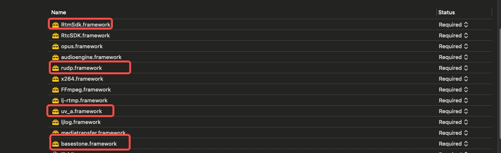

## IOS RTC 使用说明

#### 1.拷贝demo中的famework RTC相关依赖到项目中

#### 2.在项目工程中添加framework依赖


#### 3.初始化RTCSDK
```swift
        let folderName = "rtclog" // 自定义文件夹名称
        let documentsURL = FileManager.default.urls(for: .documentDirectory, in: .userDomainMask).first!
        let folderURL = documentsURL.appendingPathComponent(folderName)
        
        let rtcConfig = RtcEngineConfig()
        rtcConfig.enableNativeLog = true
        rtcConfig.logPath = folderURL.path
        LJRtcEngine rtcEngine = LJRtcEngine.sharedEngine(c : rtcConfig)
        // 设置RTC是否运行在debug模式
        engine.setDebug(debug: 1)
```
#### 4.开启或关闭视频模块
```swift
    // 开启
    rtcEngine.enableVideo()
    // 关闭
    rtcEngine.disableVideo()
```

#### 5.开启或关闭音频模块
```swift
    // 开启
    rtcEngine.enableAudio()
    // 关闭
    rtcEngine.disableAudio()
```

#### 6.设置编码参数
```swift
    public class VideoEncoderConfiguration: NSObject {
        public var dimensions = CGSize(width : 640, height : 480) //分辨率
        public var codecType = LJVideoCodecType.h264 //编码方式
        public var frameRate : Int32 = 0 //编码帧率
        public var bitrate : Int32 = 0 // 编码码率
        public var minBitrate : Int32 = 0 // 最小码率
        public var orientationMode = LJVideoMirrorMode.auto //
        public var mirrorMode = LJVideoMirrorMode.disable //是否镜像
}

    rtcEngine.setVideoEncoderConfiguration(config: VideoEncoderConfiguration)
```

#### 7.设置本地预览
```swift
     @IBOutlet weak var previewView: LJPreviewView!
     self.view.insertSubview(previewView)
     previewView.autorotate = true;
     engine.setupLocalVideo(view: previewView)
```

#### 8.设置远端用户预览
```swift
    @IBOutlet weak var remoteView : UIView!
    self.view.insertSubview(remoteView)
    engine.setupRemoteVideo(view: remoteView)
```
#### 9.开始和关闭预览
```swift
    engine.startPreivew()
    
    engine.stopPreivew()
```

#### 10.禁止本地音频采集
```swift
    rtcEngine.disableAudio()
```

#### 11.禁止本地音频采集发布
```swift
    rtcEngine.muteLocalAudioStream(mute: localMuted)
```

#### 12.禁止远端音频播放
```swift
    rtcEngine.muteRemoteAudioStream(mute: remoteMuted)
```

#### 13.设置RTC工作模式 在不同设备中，rtc工作模式必须两端不同，例如云游戏的云端为push则客户端为pull
```swift
    @objc public enum RTCWorkMode : Int32 {
        case pull = 0,
             push = 1
    }
    rtcEngine.setWorkMode(mode: mode)
```

#### 14.加入频道
```swift
    let config = ChannelConfig()
    config.userID = ***
    config.token = "***"
    config.appID = *
    config.channelID = "*"
    let udpConfig = UdpInitConfig()
    config.configs.append(udpConfig)
    _ = engine.joinChannel(channelConfig: config)
```

#### 15.退出频道
```swift
    rtcEngine?.leaveChannel()
```

#### 16.注册解码回调
```swift
    func onVideoDecodeFrame(buf: UnsafeMutableRawPointer, size: Int, width: Int, height: Int, pixelFmt: Int) {
        <#code#>
    }
    engine.registerDecodeVideoFrameObserver(delegate:self)
```

#### 17.注册视频延时信息
```swift
    func onVideoDecodeFrame(delayInfo: RtcSDK.VideoDelayInfo) {
        <#code#>
    }
    engine.registerVideoDelayInfoObserver(delegate:self)
```
#### 18.销毁RTCEngine
```swift
    engine.destroy()
```

## IOS RTM 使用说明
#### 1.拷贝demo中的famework RTM相关依赖到项目中

#### 2.在项目工程中添加framework依赖


#### 1V1 RTM使用 ([RTMViewController.swift](iosrtc/RtmViewController.swift))

#### 1.初始化

```swift
    import RtmSdk

    let config = RTMConfig()
    config.appId = GlobalConstants.appId // 服务端分配的appId
    config.localIp = 0
    config.dataWorkMode = 0
    config.isDebug = 1
    config.role = push ? RUDPMode.PUSH.rawValue : RUDPMode.PULL.rawValue // 1V1设置模式，双方使用的模式必须不一样，一端为0 另外一端必须为1
    config.token = GlobalConstants.token // 服务端分配的token
    rtmEngine = RTMEngine(config: config)

    rtmEngine?.setDebugEvn(isTestEvn: true) // 设置是正式环境还是测试环境，默认是正式环境
```

#### 2.注册链路状态回调以及消息回调实现IRtmMsgDelegate和IRtmEventDelegate

```swift
        class RTMViewController : UIViewController, IRtmMsgDelegate, IRtmEventDelegate {
            func onMsgcallbck(buf: UnsafePointer<CChar>?, size: UInt32, uid: UInt64) {
                let data = Data(bytes: buf!, count: Int(size))
                let str = String(data: data, encoding: .utf8)!
                let tempStr = "RTM onMsgcallbck uid \(uid) msg \(str)"
                showStr(tempStr: tempStr)
            }
            //LinkStatus时，status表示：API_STATUS_CONNECTED 1，API_STATUS_DISCONNECTED 2，API_STATUS_LOST 3
            func onLinkStatus(status: Int32) {
                showStr(tempStr: "RTM onLinkStatus status \(status)")
            }
        }

        rtmEngine?.eventDelegate = self
        rtmEngine?.subcribeMsgCallback(msgcallback : self)
```

#### 3.加入频道（指定uid以及channelId）

```swift
       rtmEngine?.joinChannel(uid: GlobalConstants.uid, channelId: channelTextField.text!)
```

#### 4.发送消息（支持发送String以及UnsafePointer<CChar>）

```swift
       rtmEngine?.sendMsg(msg: "test msg")
       rtmEngine?.sendMsg(msg : UnsafePointer<CChar>, len : Int32)
```

#### 5.退出频道
```swift
        rtmEngine?.leveChannel()
        rtmEngine = nil
```

#### 多人 RTM使用[MultiRTMViewController.swift](iosrtc/MultiRTMViewController.swift)

#### 1.初始化

```swift
    import RtmSdk

    let config = RTMExConfig()
    config.appId = GlobalConstants.appId // 服务端分配的appId
    config.localIp = 0
    config.dataWorkMode = 0
    config.isDebug = 1
    config.role // 可以不用填，默认为1
    config.token = GlobalConstants.token // 服务端分配的token
    rtmEngine = RTMEngineEx(config: config)

    rtmEngine?.setDebugEvn(isTestEvn: true) // 设置是正式环境还是测试环境，默认是正式环境
```

#### 2.注册链路状态回调以及消息回调实现IRtmMsgDelegate和IRtmExEventDelegate

```swift
        class MultiRTMViewController : UIViewController, IRtmMsgDelegate,IRtmExEventDelegate {
            public func onJoinChannelFail(result: Int32, msg: String) {
                showStr(tempStr: "RTMEx onJoinChannelFail result \(result) msg \(msg)")
            }
            
            public func onLeveChannelFail(result: Int32, msg: String) {
                showStr(tempStr: "RTMEx onLeveChannelFail result \(result) msg \(msg)")
            }
            
            public func onUserJoined(userId: UInt64) {
                showStr(tempStr: "RTMEx onUserJoined userId \(userId)")
            }
            
            public func onUserOffLine(userId: UInt64) {
                showStr(tempStr: "RTMEx onUserOffLine userId \(userId)")
            }
            
            public func onJoinChannelSuccess() {
                showStr(tempStr: "RTMEx onJoinChannelSuccess")
            }
            
            public func onLeveChannelSuccess() {
                showStr(tempStr: "RTMEx onLeveChannelSuccess")
            }
            
            //LinkStatus时，status表示：API_STATUS_CONNECTED 1，API_STATUS_DISCONNECTED 2，API_STATUS_LOST 3
            func onLinkStatus(status: Int32) {
            public func onLinkStatus(status : Int32) {
                showStr(tempStr: "RTMEx onLinkStatus status \(status)")
            }
        }

        rtmEngine?.eventDelegate = self
        rtmEngine?.subcribeMsgCallback(msgcallback : self)
```

#### 3.加入频道（指定uid以及channelId）

```swift
       rtmEngine?.joinChannel(uid: GlobalConstants.uid, channelId: channelTextField.text!)
```

#### 4.发送消息（支持发送String以及UnsafePointer<CChar>）

```swift
       rtmEngine?.sendMsg(msg: "test msg")
       rtmEngine?.sendMsg(msg : UnsafePointer<CChar>, len : Int32)
```

#### 5.退出频道
```swift
        rtmEngine?.leveChannel()
        rtmEngine = nil
```
